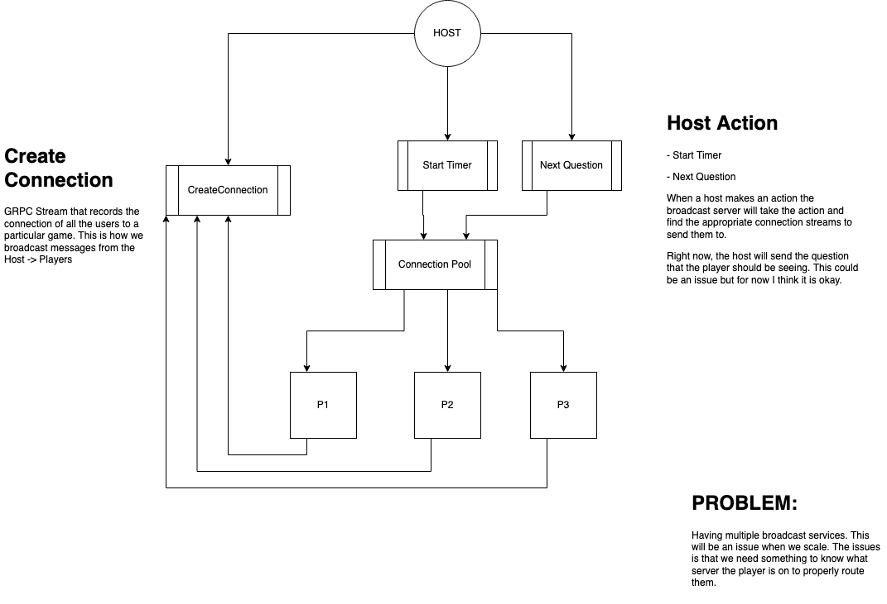

# Broadcasting (streaming)

PQ uses a real time events streaming approach to connect users together in a game.

Under the hood, PQ utilizes GRPC Streaming over websockets. The reason for this is because the future seems to be better suited for HTTP/2. GRPC also allows us to define the incoming message and bootstrap services together faster.

# Flow of events

